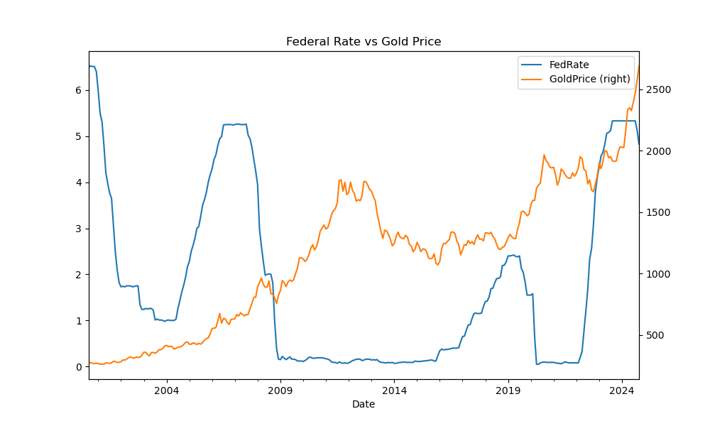
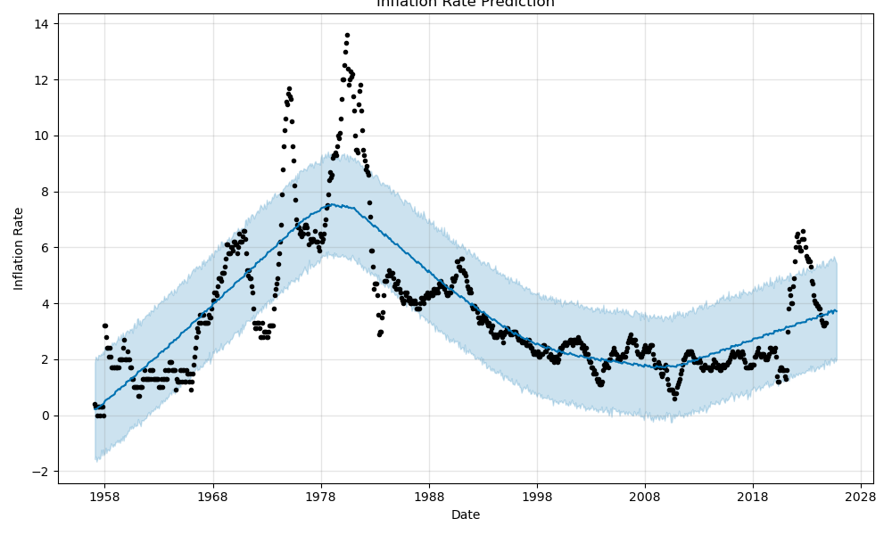

# Analysis of Economic Indicators and Monetary Policy on Markets

## Table of Contents

[Overview](#overview)

[Data Analysis](#data-analysis)

[The Team](#the-team)

## Project Overview

### Overview

This project aims to measure the impact of economic indicators and monetary policy on the market. We examined monthly financial data, focusing primarily on the **S&P 500 index**, **treasury bond rates**, and **gold prices** to understand historical trends and understand how the markets may move in the near future. The project provides insights that could aid in strategic decision-making for financial analysts, investors, and policymakers by employing time series analysis and forecasting models.

### Questions we aim to answer

1. **What were the trends in the S&P 500, treasury bonds, and gold prices from 2007 to the present?**
2. **What is the correlation between FedFund rates and SNP500, 10-year Treasuries, Gold, Unemployment, and inflation?**
3. **Predict future Inflation Rates and Unemployment rates to inform investment decisions.**

### Usage and installation instructions

#### Execution

1. Install Dependencies. Make sure all required libraries are installed.

    pip install pandas prophet matplotlib

    1. Ensure that the dependencies are installed to successfully import the below:

    import pandas as pd 
    import datetime as dt 
    from prophet import Prophet 
    import pandas as pd 
    import datetime as dt 
    from prophet import Prophet 
    import yfinance as yf 
    import matplotlib.pyplot as plt 
    import numpy as np 
    from scipy.signal import correlate 
    from datetime import date

1. Open and run [monthly_analysis.ipynb](monthly_analysis.ipynb:) in a Jupyter Notebook or Jupyter Lab.

#### High-level logic contained in monthly_analysis.ipynb:

1. Read the following CSV files from [./Resouces](./Resources/):

    SNP500, FEDFUNDS, bls-monthly-unemployment, 10-Year Treasury, GoldPricesMonthly, inflation_rate_US

1. Data cleaning
Each data set is edited to bring the date in the index column and retain only 1 column showing the data of interest.

1. Concatenate
Concatenate all the data frames into a single frame that includes all the monthly data from 2007 to 2024.

1. Run correlations matrix and visualizations to observe the relationships between the data

1. Model Training and Forecasting:
The notebook will train the model using the input data and generate forecasts.
Show forecasting trends for Unemployment and Inflation.

Files:
 monthly_analysis.ipynb: The main notebook for performing monthly time series analysis and forecasting.

## Data Analysis

### Business Understanding

This project examines the movements of the S&P 500, 10-Year Treasury and Gold Prices based on Fed Monetary policy, Inflation and Unemployment data. By understanding these relationships, we hope to inform potential investment decisions in 2025.

### Data Understanding

This project leverages a comprehensive dataset containing several economic and financial indicators that collectively offer a multifaceted view of the U.S. market dynamics from 2007 to 2024. Key datasets include:

#### 1. S&P 500 Index

  This index represents the stock performance of 500 leading companies in the U.S., serving as a barometer for the overall health of the U.S. economy. The S&P 500 is essential for understanding market trends and investor sentiment.

#### 2. Treasury Bond Rates

  Data on ten-year Treasury bond yields provides insights into long-term government debt trends. Treasury yields often reflect investor confidence in the market and influence both short-term and long-term interest rates, making them valuable for evaluating financial conditions and market stability.

#### 3. Gold Prices

  Gold is traditionally seen as a safe haven asset, and its price movements often reflect investor sentiment during economic uncertainty. Analyzing gold prices alongside other assets helps us understand how investors react to inflationary pressures and financial risks.

#### 4. Inflation Indicators (Core US Inflation)

  The Consumer Price Index (CPI) measures inflation by tracking changes in the prices of goods and services, while interest rate data reflects the Federal Reserve's monetary policies. These indicators reveal how inflation and policy decisions affect consumer purchasing power and market conditions.

#### 5. Employment Metrics (Unemployment and Labor Force Participation Rates)

  Employment data includes the unemployment rate and the civilian labor force participation rate, which indicate the health of the labor market and the level of economic engagement. These metrics help gauge productivity, labor market tightness, and economic stability.

Each dataset is resampled to a quarterly basis to smooth monthly volatility and uncover long-term trends. This aggregation supports the project’s goal of identifying patterns, correlations, and predictive trends between the stock market and macroeconomic indicators, making it possible to anticipate the S&P 500's future movements.
By studying the relationships among these datasets, the project aims to reveal how economic indicators and policy shifts influence the market. Insights from this analysis can aid financial analysts, investors, and policymakers in making informed decisions based on historical trends and anticipated changes in economic conditions.

### Data Sources

S&P 500 (s&p index) - [YFinance](https://pypi.org/project/yfinance/)

10-Year US Treasuries - [YFinance](https://pypi.org/project/yfinance/)

Fed Interest Rates -  [Fed Reserve Data Download](https://www.federalreserve.gov/datadownload/)

Inflation (US Core inflation) - [Trading Economics](https://data.tradingeconomics.com)

Unemployment - [BLS Unemployment](https://www.bls.gov/data/#unemployment)

Gold - (Gold Futures) - - [Trading Economics](https://data.tradingeconomics.com)

### Analysis

1. **What were the trends in the S&P 500, Fedrates, inflation treasury bonds, and gold prices from 2007 to the present?**

For the SNP

SNP historical data shows the drop of the market post-2008 financial crisis as well as the drop during the 2020 pandemic and subsequent recovery
Similarly, FedRates dropped close to 0 to stimulate the market post-2008 financial crisis and again during the pandemic. A steep rise in 2022 was employed by the Fed to combat fast-rising inflation (see inflation data) caused by the stimulus policy (~1.5 trillion (check)

Gold Rose significantly post-2008 (calculate % between 2008 and 2012) - as markets flew to safety and had another x% increase during the pandemic, followed by a further x% increase after 2024. We would expect Gold to increase in parallel with the inflation spike of 2022-23 (as Gold is an inflation protection instrument). However, the spike occurred in 2024 as inflation was dropping and under control.

Treasuries follow the same pattern as FedRates in response to the financial crisis and the pandemic, which is expected.

2. **What is the correlation between FedFund rates and SNP500, 10-year Treasuries, Gold, Unemployment, and inflation?**

**The highest correlations:  
Gold Price and SNP500
Fed Rate and 10Year T rate
SNP 500 and inflation rate
Unemployment rate and SNP500 and FedRate - Inversely correlated, which makes sense (as the market does well, it means that unemployment is lower, and usually employment data releases lead to market movements (low unemployment, market rises, high unemployment, market drops). Similarly, FedRate- low Rates stimulate the economy and push unemployment. 

**Surprises: 
Gold and the SNP 500 have a strong correlation—I'm not sure why. Gold is a type of inflation protection and flight-to-safety asset. SNP, while there is a correlation with inflation, it is not strong, and typically, equities are considered risky assets. I need to explore this further.
FedRate—Inflation Rate (0.29)—We would expect Fed Rates to follow inflation (the Fed typically raises rates in response to high inflation).

4. **Predict future Inflation Rates and Unemployment rates to inform investment decisions.**

The Pearson prediction model via Meta's Prophet was used to create the following predictions.

* Inflation Prediction

As of 2015, the overall trend is for inflation to rise. The trend is predicted to continue at least through fall of 2025.
Peak inflation rates for the year are anticipated in May.

* Unemployment Prediction

The sharp 2020 unemployment increase was not predicted. The likely trigger was the unanticipated COVID-19 outbreak.
Unemployment is projected to remain fairly steady until at least fall of 2025, which end of the prediction time period.
Unemployment is anticipated to drop in March, assuming normal seasonality.

## The Team

[GIBueno25](https://github.com/GIBueno25)

[rgoldstein24](https://github.com/rgoldstein24)

[tamfree](https://github.com/tamfree)

[ttsai19](https://github.com/ttsai19)

[yiannisp1822](https://github.com/yiannisp1822)
