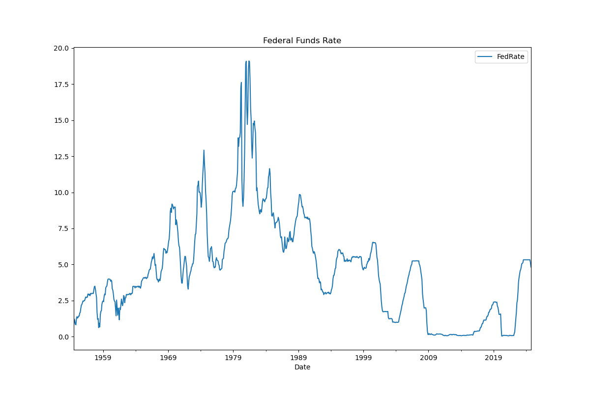
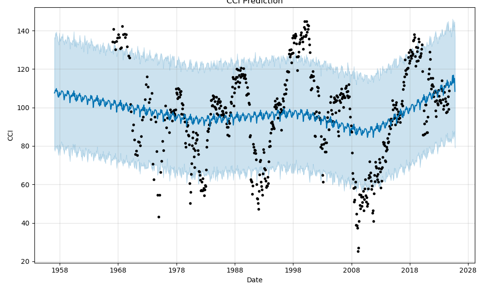

# Analysis of Economic Indicators and Monetary Policy on Markets

## Table of Contents

[Overview](#overview)

[Data Analysis](#data-analysis)

[Presentation](#presentation)

[The Team](#the-team)

## Project Overview

### Overview

This project aims to measure the relationship between leading economic indicators on market data and lagging economic indicators. Specifically, we looked at how leading indicators such as the stock market, Consumer Confidence Index (CCI) and the Treasury Yield Curve affect and correlate with monetary policy (Fed Rates), Unemployment and Inflation and modeled forecasts to help inform potential investment decisions

### Questions we aim to answer

1. What are the historical trends across, the
- Leading indicators: SNP500, Gold, Yield Curve, CCI
- Lagging indicators: Unemployment, Inflation and Interest Rates
2. What is the correlation between leading and lagging indicators and what is the timeshift (if any)
3. Predict future US Inflation, Unemployment and Fed Rates to inform investment decisions. Cross reference potential course of action with forecasted market data for S&P 500, the 2-10 Year Treasury spreads (Yield Curve) and CCI

### Usage and installation instructions

#### Execution

1. Make sure all required libraries are installed by executing the below.

    pip install pandas prophet matplotlib  
    pip install yfinance --upgrade --no-cache-dir

    1. Ensure that the dependencies are installed to successfully import the below:

    **Import the required libraries and dependencies** 
    
    import pandas as pd  
    import datetime as dt 
    from prophet import Prophet 
    import pandas as pd 
    import datetime as dt 
    from prophet import Prophet 
    import yfinance as yf 
    import matplotlib.pyplot as plt 
    import numpy as np 
    from scipy.signal import correlate 
    from datetime import date 
    import seaborn as sns 

1. Open and run [monthly_analysis2.ipynb](monthly_analysis_2.ipynb) in a Jupyter Notebook or Jupyter Lab.

#### High-level logic contained in monthly_analysis.ipynb:

[monthly_analysis.ipynb](monthly_analysis_2.ipynb) is the main notebook for performing monthly time series analysis and forecasting.

1. Read the following CSV files from [./Resouces](./Resources/):

    US-monthly-unemployment, Inflation, CCI_US, T10Y2Y

2. Use Yahoo Finance to get: 
    SNP500 (ticker yf.Ticker('^GSPC')) 
    Gold (yf.ticker = 'GC=F') 
   Treasury 10year (yf.ticker('^TNX')) 
   

1. Data cleaning

    Each data set is edited to bring the date in the index column and retain only 1 column showing the data of interest.
   Set the date as the index and convert to datetime format
   Resample to get the data in monthly frequency and set the start of each month to the first day of the month
   Remove any N/A, Null data

1. Concatenate

    Concatenate all the data frames into a single frame that includes all the monthly data (common columns from 2000 to 2004)

1. Run correlations matrix and visualizations to observe the relationships between the data

1. Model Training and Forecasting:

    The notebook will train the model using the input data and generate forecasts.
Show forecasting trends for Unemployment and Inflation.

## Data Analysis

### Business Understanding

This project aims to measure the relationship of leading economic indicators on market data and lagging economic indicators. Specifically, we looked at how leading indicators such as the stock market, Consumer Confidence Index (CCI) and the Treasury Yield Curve affect and correlate with monetary policy (Fed Rates), Unemployment and Inflation and modeled forecasts to help inform potential investment decisions.

### Data Understanding

This project leverages a comprehensive dataset containing several economic and financial indicators that collectively offer a multifaceted view of the U.S. market dynamics. Key datasets include:

#### 1. S&P 500 Index

  This index represents the stock performance of 500 leading companies in the U.S., serving as a barometer for the overall health of the U.S. economy. The S&P 500 is essential for understanding market trends and investor sentiment.

#### 2. Gold Prices

  Gold is traditionally seen as a safe haven asset, and its price movements often reflect investor sentiment during economic uncertainty. Analyzing gold prices alongside other assets helps us understand how investors react to inflationary pressures and financial risks.

#### 3. Yield Curve
The Yield Curve is the spread between the 2Y and 10Y treasury bond rates and is a leading indicator of the economy. An inverted Yield curve usually signifies a recession. 

#### 4. CCI
CCI - Consumer Confidence Index indicates the consumer's confidence and is a leading economic indicator  that signals the appetite to spend.

#### 4. Inflation Indicators (Core US Inflation)

  The Consumer Price Index (CPI) measures inflation by tracking changes in the prices of goods and services, while interest rate data reflects the Federal Reserve's monetary policies. These indicators reveal how inflation and policy decisions affect consumer purchasing power and market conditions.

#### 5. Employment Metrics (Unemployment and Labor Force Participation Rates)

  Employment data includes the unemployment rate and the civilian labor force participation rate, which indicate the health of the labor market and the level of economic engagement. These metrics help gauge productivity, labor market tightness, and economic stability.

#### 6. Fed Rates(interest rates)- Interest Rates are set by the Fed as part of the US monetary policy in order to modulate the economy

Each dataset is resampled to a monthly basis. This aggregation supports the project’s goal of identifying patterns, correlations, and predictive trends between the stock market and macroeconomic indicators, making it possible to anticipate the S&P 500's future movements.
By studying the relationships among these datasets, the project aims to reveal how economic indicators and policy shifts influence the market. Insights from this analysis can aid financial analysts, investors, and policymakers in making informed decisions based on historical trends and anticipated changes in economic conditions.

### Data Sources

S&P 500 (s&p index) - YFinance
Yield Curve - https://fred.stlouisfed.org/series/T10Y2Y
Fed Interest Rates - Fed Reserve Data Download
Inflation (US Core inflation) - Trading Economics
Unemployment - BLS Unemployment
Gold  - YFinance
CCI- https://insights.ceicdata.com/

### Analysis

1. **What were the trends in the S&P 500, Yield Curve, CCI, Gold prices  Fedrates, inflation, and Unemployment as far as 1950s (varies by dataset) to the present?**

  For the SNP
  

For Yield Curve:
 

For CCI:

For FedFunds Rate:

For Inflation:

For Unemployment Rate:

All historical data provides evidence of the market reaction during key events (1970's inflation, 2000 dotcom bubble, 2008 financial crisis, 2020 pandemic, 2022 inflation)

2. **What is the correlation between FedFund rates and SNP500, 10-year Treasuries, Gold, Unemployment, and inflation?**

#### The highest correlations:  

SNP Inflation 0.65
CCI Unemployment -0.78
Yield Curve Fed Rate-0.71
Yield Curve Unemployment 0.68
Yield Curve Inflation Rate -0.60

#### Surprises:

When looking at the cross-correlation lag between these indicators, correction seems to occur at the 0 point (ie no time shift). Given the leading and lagging relationship, we would have expected to see some lag. However, given the fact that we are taking monthly mean samples we may not have a granular enough view.
Fed Rate predictions seem to indicate a rise in rates however this is in contrast to the recent news (fed expected to keep rates stable or lower)

4. **Predict future Inflation Rates, Unemployment, and Fed Rates and see the relationship with their closely correlated leading indicators
   SNP500, CCI, and YC, respectively.**

   The Pearson prediction model via Meta's Prophet was used to create the following predictions.

* Inflation Prediction

As of 2015, the overall trend is for inflation to rise. The trend is predicted to continue at least through fall of 2025.
Peak inflation rates for the year are anticipated in May.

* SNP Predictions

* Unemployment Prediction

* CCI Prediction

The sharp 2020 unemployment increase was not predicted. The likely trigger was the unanticipated COVID-19 outbreak.
Unemployment is projected to remain fairly steady until at least fall of 2025, which end of the prediction time period.
Unemployment is anticipated to drop in March, assuming normal seasonality.

* FedRate prediction

FedRates are predicted to rise in the next 12 months. However, this is not in line with recent news (Fed unlikely to do raises in the near future - if anything, more cuts are predicted)

* Yield Curve prediction

Forecasts confirm the inverse relationship of  the YC and FedRates
With YC trending downwards one should expect Fed Rate to rise in the near future.

## Presentation

<iframe
  src="https://docs.google.com/presentation/d/1HBCpvfkWIzQ6nDba2KJSNt6SU1Rmlibu/edit?usp=sharing&ouid=104881676550207667402&rtpof=true&sd=true"
  style="width:100%; height:300px;"
></iframe>

[Presentation Link](https://docs.google.com/presentation/d/1HBCpvfkWIzQ6nDba2KJSNt6SU1Rmlibu/edit?usp=sharing&ouid=104881676550207667402&rtpof=true&sd=true)

## The Team

[GIBueno25](https://github.com/GIBueno25)

[rgoldstein24](https://github.com/rgoldstein24)

[tamfree](https://github.com/tamfree)

[ttsai19](https://github.com/ttsai19)

[yiannisp1822](https://github.com/yiannisp1822)
